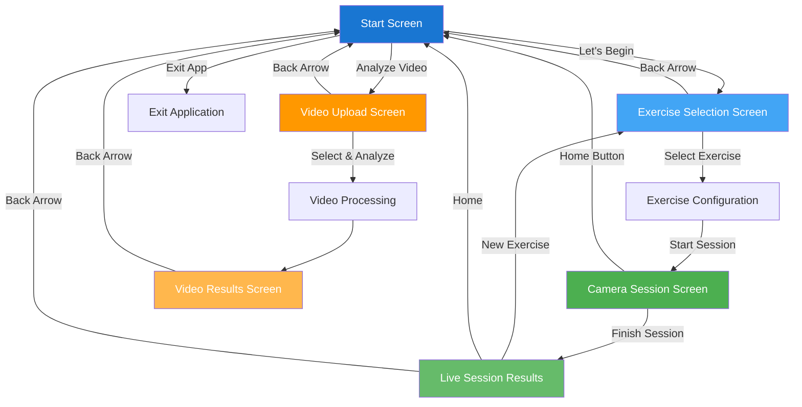

# PoseCoach Android App - User Flows & Navigation

## Overview
PoseCoach provides two main user flows for exercise form analysis:
1. **Live Session Flow** - Real-time camera-based exercise tracking
2. **Video Analysis Flow** - Upload and analyze pre-recorded videos

---

## Flow Diagram

---

## Detailed Screen-by-Screen Breakdown

### 🏠 **1. START SCREEN** (Entry Point)

#### **Purpose**
Welcome screen providing access to both main flows and app exit.

#### **Buttons & Actions**
| Button | Action | Destination |
|--------|--------|-------------|
| **"Let's Begin"** | Start live camera session | Exercise Selection Screen |
| **"Analyze Video"** | Upload video for analysis | Video Upload Screen |
| **"Exit App"** | Close application | Exit |

#### **Visual Elements**
- PoseCoach logo
- Background image with white overlay
- "How it works" instruction card explaining the app's purpose

---

### 📱 **FLOW 1: LIVE SESSION (Real-Time Camera)**

---

### **2. EXERCISE SELECTION SCREEN**

#### **Purpose**
Choose exercise type and configure workout parameters.

#### **Navigation Buttons**
| Button | Action | Destination |
|--------|--------|-------------|
| **Back/Forward Arrow** (top right) | Return to previous screen | Start Screen |
| **Exercise Card** | Select exercise type | Exercise Configuration |
| **Info Button** ⓘ | View tutorial | Tutorial Dialog |

#### **Exercise Selection Cards**
Three exercise types available:
1. **Push-up** - Upper body strength
2. **Squat** - Lower body strength
3. **Plank** - Core stability exercise

Each card includes:
- Exercise logo/icon
- Exercise name
- Brief description
- Info button for tutorial video

#### **Exercise Configuration Panel**

**For Plank:**
- **Mode Selection:**
  - **"Timed"** button - Set specific duration goal
  - **"Free"** button - No time limit
- **Duration Picker** (if Timed mode):
  - Range: 30 seconds to 5 minutes
  - Increment: 10 seconds

**For Squat & Push-up:**
- **Mode Selection:**
  - **"Count Reps"** button - Set rep goal
  - **"Free"** button - No rep limit
- **Rep Counter Picker** (if Count mode):
  - Range: 1 to 30 reps
  - Increment: 1 rep

#### **Start Session Requirements**
| Element | Requirement |
|---------|-------------|
| **Checkbox** | "I understand the instructions" - Must be checked |
| **"Back" Button** | Return to exercise list |
| **"Start Session" Button** | Begin camera session (enabled only when checkbox is checked) |

---

### **3. CAMERA SESSION SCREEN**

#### **Purpose**
Real-time exercise tracking with live pose detection and feedback.

#### **Control Buttons**
| Button | Action | Function |
|--------|--------|----------|
| **Home Button** | Exit or finish session | Returns to Start Screen (finishes session if active) |
| **Camera Switch** | Toggle camera | Switch between front/back camera |
| **GPU Toggle** | Switch processing mode | Toggle between GPU/CPU processing |
| **Reset Rep Count** | Reset counter | Resets current repetition count to 0 |
| **Start Session** | Begin workout | Starts 3-2-1 countdown then begins tracking |
| **Finish Session** | End workout | Completes session and navigates to results |

#### **Real-Time Display Elements**

**Visual Overlays:**
- **Camera Preview** - Live video feed
- **Pose Skeleton** - Real-time body tracking overlay with joint points
- **Countdown Overlay** - "3-2-1" countdown with positioning instructions

**Information Display:**
- **FPS Counter** - Processing speed indicator
- **Feedback Messages** - Real-time form corrections (color-coded by severity)
- **Rep Counter** - Current repetition count (Squat/Push-up only)
- **Timer Display**:
  - Plank: Time held / Time remaining (if timed mode)
  - Others: Elapsed time

**Session States:**
1. **IDLE** - Waiting to start
2. **COUNTDOWN** - 3-2-1 countdown with positioning guidance
3. **ACTIVE** - Exercise in progress
4. **FINISHED** - Session complete

---

### **4. LIVE SESSION RESULTS SCREEN**

#### **Purpose**
Display comprehensive session analysis with form feedback and statistics.

#### **Navigation Buttons**
| Button | Action | Destination |
|--------|--------|-------------|
| **Back/Forward Arrow** | Return to start | Start Screen |
| **"New Exercise"** | Start another session | Exercise Selection Screen |
| **"Home"** | Return to main menu | Start Screen |

#### **Exercise Type Tabs**
- Displayed when multiple exercises completed in one session
- Switch between different exercise statistics
- Shows: Exercise name (e.g., "Squat", "Plank", "Push-up")

#### **Information Display**

**Overall Score Card:**
- Form score percentage (0-100%)
- Quality rating:
  - ≥80%: "Excellent Form!"
  - 60-79%: "Good Form - Minor improvements needed"
  - <60%: "Form needs improvement"

**Session Statistics Card:**

*For Rep-Based Exercises (Squat, Push-up):*
- Completed Reps
- Target Reps
- Duration (MM:SS format)

*For Plank:*
- Target Time (if set)
- Total Duration
- Time Held Correctly
- Form Breaks count

**Total Workout Summary** (if multiple exercises):
- Total Exercises completed
- Total Reps (or Total Time for plank)
- Total Workout Time

#### **Feedback Tabs**
| Tab | Content |
|-----|---------|
| **Current** | Feedback from the last exercise session |
| **Common** | Issues that appeared across all sessions |
| **All** | Complete list of all feedback messages |

#### **Feedback Categories**
Feedback messages are organized by severity:

1. **✓ Good Form** (Green - INFO)
   - Correct form points
   - No point deduction

2. **⚠️ Warnings** (Orange - WARNING)
   - Minor form issues
   - -5 points per warning

3. **❌ Errors** (Red - ERROR)
   - Major form problems
   - -10 points per error

Each feedback card shows:
- Icon (✓ / ⚠️ / ❌)
- Feedback message text
- Point deduction (for warnings/errors)

---

### 📹 **FLOW 2: VIDEO ANALYSIS**

---

### **5. VIDEO UPLOAD SCREEN**

#### **Purpose**
Upload and configure video for offline analysis.

#### **Navigation Buttons**
| Button | Action | Destination |
|--------|--------|-------------|
| **Back Arrow** | Return to main menu | Start Screen |

#### **Video Selection**
| Element | Action |
|---------|--------|
| **Video Selection Card** | Opens device file picker |
| **Status Display** | Shows "Video Selected" or "Tap to Select Video" |

#### **Exercise Selection Cards**
Same three exercise types as live session:
- **Push-up** card
- **Squat** card
- **Plank** card

Selection indicated by:
- Border highlight
- Checkmark icon

#### **Processing Controls**
| Button | Enabled When | Action |
|--------|--------------|--------|
| **"Analyze Video"** | Video AND exercise selected | Starts video processing |

#### **Processing Feedback**
- **Progress Bar** - Visual progress indicator (0-100%)
- **Progress Text** - "Processing video... XX%"
- **Error Messages** - Displayed in red card if processing fails

---

### **6. VIDEO RESULTS SCREEN**

#### **Purpose**
Display analysis results with playback controls.

#### **Navigation**
| Button | Action | Destination |
|--------|--------|-------------|
| **Back Arrow** | Return to main menu | Start Screen |

#### **Video Playback Controls**
| Control | Function |
|---------|----------|
| **Play/Pause** | Toggle video playback |
| **Timeline Scrubber** | Navigate through video timeline |
| **Speed Controls** | Adjust playback speed (0.5x, 1x, 2x) |

#### **Analysis Display**
- **Video Player** - Analyzed video with pose overlay
- **Form Score** - Overall percentage score
- **Statistics**:
  - Rep count (if applicable)
  - Video duration
  - Analysis timestamp
- **Feedback Messages** - Organized by severity (same as live results)
- **Pose Skeleton Overlay** - Shows detected pose on video frames

---

## Permission Requirements

### **Live Session Flow**
- **Camera Permission** (`CAMERA`)
  - Required before accessing camera
  - Requested on screen load
  - Permission denied screen with retry option

### **Video Analysis Flow**
- **Storage Permission**:
  - Android 13+: `READ_MEDIA_VIDEO`
  - Android 12 and below: `READ_EXTERNAL_STORAGE`
  - Requested on screen load
  - Permission denied screen with explanation and retry option

---

## Complete Button Summary

### **Total Buttons by Screen**

| Screen | Button Count | Primary Actions |
|--------|--------------|-----------------|
| **Start Screen** | 3 | Navigate to flows or exit |
| **Exercise Selection** | 8+ | Select exercise, configure, view tutorial, start |
| **Camera Session** | 6 | Control camera, manage session, switch settings |
| **Live Results** | 3 | Navigate to new session or home |
| **Video Upload** | 3 | Select video, choose exercise, analyze |
| **Video Results** | 4+ | Playback controls, navigation |

---

## User Journey Examples

### **Example 1: Live Squat Session**
1. Start Screen → "Let's Begin"
2. Exercise Selection → Select "Squat" card
3. Configuration → Choose "Count Reps", set to 10 reps
4. Configuration → Check "I understand" → "Start Session"
5. Camera Session → Camera preview loads
6. Camera Session → "Start Session" → 3-2-1 countdown
7. Camera Session → Perform 10 squats (real-time feedback shown)
8. Camera Session → "Finish Session" (or auto-finish at 10 reps)
9. Live Results → View 85% score, feedback messages
10. Live Results → "Home" → Return to Start

### **Example 2: Video Analysis**
1. Start Screen → "Analyze Video"
2. Video Upload → Tap video card → Select video from device
3. Video Upload → Select "Push-up" exercise card
4. Video Upload → "Analyze Video" → Processing (0-100%)
5. Video Results → View analyzed video with pose overlay
6. Video Results → Review feedback and score
7. Video Results → Back Arrow → Return to Start

---

## Technical Features

### **Real-Time Processing**
- **Pose Detection**: MediaPipe Pose Landmarker
- **Processing Modes**: 
  - GPU acceleration (faster)
  - CPU fallback (compatible)
- **Frame Rate**: Displayed FPS counter
- **Feedback Latency**: Real-time (<100ms)

### **Form Analysis**
- **Joint Angle Calculations**: Knee, hip, elbow, shoulder angles
- **Body Alignment Checks**: Spine straightness, body positioning
- **Movement Pattern Recognition**: Rep counting, form break detection
- **Scoring System**: Point-based deduction from 100%

### **Session Management**
- **Multi-Exercise Sessions**: Track multiple exercises in one session
- **History Tracking**: Session history per exercise type
- **State Persistence**: Maintains data through navigation

---

## Conclusion

The PoseCoach app provides an intuitive, two-path user experience:
- **Live Session Flow** for real-time guidance and immediate feedback
- **Video Analysis Flow** for post-workout review and improvement

Both flows converge on comprehensive results screens that provide actionable feedback, detailed statistics, and clear navigation options to continue training or return to the main menu.
